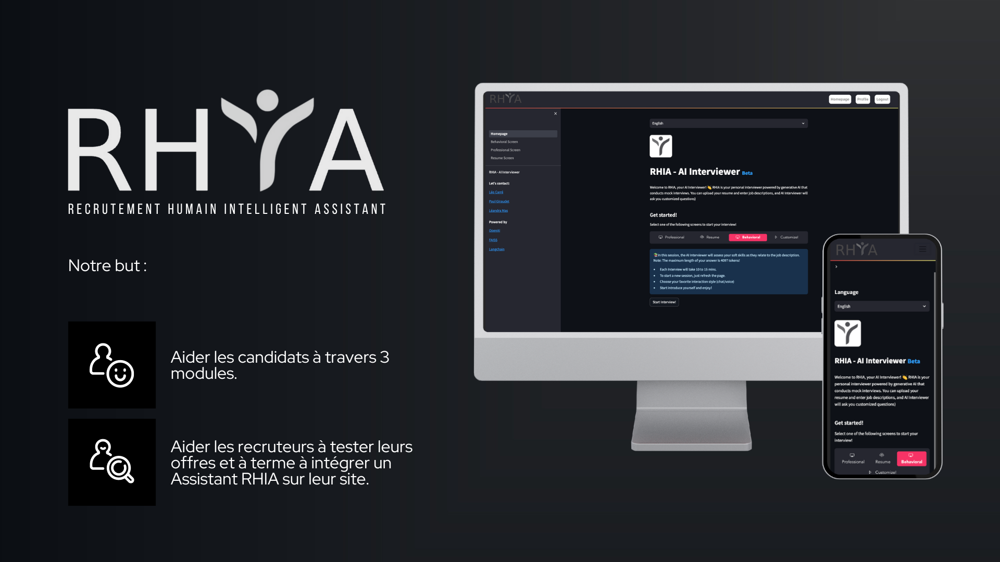

# RHIA - Votre plateforme ultime pour la préparation aux processus de recrutement



Bienvenue sur RHIA, votre plateforme ultime pour la préparation aux processus de recrutement ! RHIA est une application web polyvalente conçue pour aider aussi bien les candidats que les recruteurs à perfectionner leurs compétences. Que vous soyez un chercheur d'emploi souhaitant affiner votre CV, pratiquer des scénarios d'entretien adaptés à des descriptions de poste spécifiques ou améliorer vos compétences interpersonnelles, RHIA est là pour vous. Avec RHIA, les candidats peuvent télécharger leurs CV et descriptions de poste, tandis que les recruteurs peuvent accéder à une base de données riche en scénarios d'entretien et exercices de compétences interpersonnelles.

[Présentation du projet](https://www.canva.com/design/DAGDLmD2nv8/guU9juPfu0qS7-WqDVArGg/edit?utm_content=DAGDLmD2nv8&utm_campaign=designshare&utm_medium=link2&utm_source=sharebutton)

## Sommaire

- [Vue d'ensemble](#vue-densemble)
- [Pour commencer](#pour-commencer)
- [Fonctionnalités](#fonctionnalités)
- [Technologies utilisées](#technologies-utilisées)
- [Installation du projet](#installation-du-projet)   
- [Remerciements](#remerciements)

## Vue d'ensemble

RHIA vise à révolutionner votre processus de préparation aux entretiens. Que vous cherchiez à améliorer vos compétences techniques, vos capacités de communication ou votre adaptabilité, cette application peut vous aider. Alimentée par une technologie de pointe d'OpenAI, FAISS et Langchain, RHIA offre une expérience fluide qui simule des scénarios d'entretien réels.

## Pour commencer

Pour commencer votre expérience RHIA, suivez ces étapes simples :

1. **Inscription / Connexion :** Inscrivez vous et connectez vous pour accéder aux fonctionnalités de l'applications. Vos informations sont modifiable à tout moment une fois connecté dans l'onglet "Profile"

2. **Sélectionnez le type d'entretien :** Choisissez parmi les écrans d'entretien suivants :
   - **Page d'accueil :** Aperçu de RHIA.
   - **Écran Soft Skills ou "Behavioral Screen" :** Évaluez vos compétences comportementales.
   - **Écran professionnel ou "Professional Screen" :** Évaluez vos compétences techniques.
   - **Écran de CV ou "Resume Screen" :** Revoyez votre CV téléchargé.
   
3. **Personnalisez votre expérience :** Personnalisez votre entretien en téléchargeant votre CV et/ou en fournissant des descriptions de poste.

4. **Commencez l'entretien :** Démarrez l'entretien en vous présentant et en répondant aux questions générées par l'IA.

## Fonctionnalités

- **Authentification :** Les utilisateurs peuvent s'inscrire et se connecter avec la possibilité de modifier leurs informations.
- **Préparation d'entretien personnalisée :** Les utilisateurs peuvent saisir une offre d'emplois / description de poste, et l'application génère des questions d'entretien ciblées adaptées aux exigences spécifiques du poste. L'application couvre divers types d'entretiens, y compris professionnels, soft skills et basés sur le CV, garantissant que les utilisateurs sont prêts à gérer différents scénarios d'entretien.
- **Évaluation et conseils personnalisés :** Après avoir terminé un entretien simulé, les utilisateurs reçoivent des évaluations personnalisées avec des retours et des recommandations concrètes pour les aider à améliorer leurs compétences en entretien.

## Technologies utilisées

- **Frontend :** HTML, CSS, JavaScript, Streamlit (Framework)
- **Backend :** Python, Django, SQLite
- **Traitement du langage naturel (NLP) :** NLTK, TensorFlow
- **Modèles génératifs :** OpenAI GPT
- **Clé d'Apis :** OpenAI GPT, Amazon Web Services (AWS)


## Installation du projet

### 1. Télécharger le dossier

Pour commencer, téléchargez le dossier du projet depuis GitHub en utilisant la commande suivante :

```bash
git clone https://github.com/LeoCarre/RHIA.git
```

### 2. Installer les applications
Le projet RHIA comprend deux applications : une application Streamlit et une application Django. Pour installer et faire fonctionner ces applications, veuillez suivre les instructions ci-dessous :

Application 1 : GPTInterviewer-main
Rendez-vous dans le dossier de l'application Streamlit :

```bash
cd RHIA/GPTInterviewer-main
```
Suivez les instructions détaillées dans le fichier README de l'application Streamlit.

Application 2 : Django
Rendez-vous dans le dossier de l'application Django :

```bash
cd RHIA/RHIA-Authentification
```

Suivez les instructions détaillées dans le fichier README de l'application Django.

## Remerciements

RHIA est alimenté par un mélange de technologies avancées :

- OpenAI : Fournissant les capacités d'IA générative.
- FAISS : Amélioration des capacités de recherche et de récupération.
- Langchain : Facilitant les interactions en langage naturel.

L'application est fièrement construite avec [Streamlit](https://streamlit.io/).

---

N'oubliez pas, RHIA est votre partenaire dans la préparation de vos futurs entretiens. Aiguisez vos compétences, boostez votre confiance et saisissez ces opportunités de carrière avec assurance ! 🚀